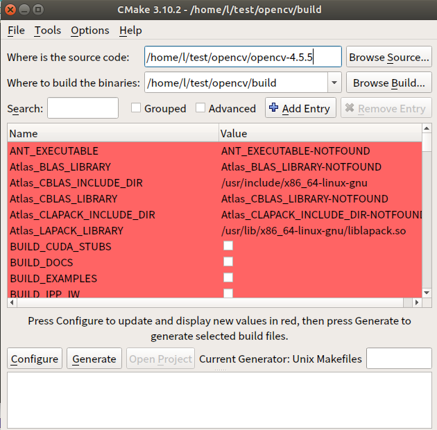

# opencv


- [二进制安装](#二进制)
- [源代码构建](#源代码构建)

- [Docker镜像](#docker镜像)


参考：[**OpenCV installation overview**](https://docs.opencv.org/4.x/d0/d3d/tutorial_general_install.html)

参考：[**Install OpenCV-Python in Ubuntu**](https://docs.opencv.org/4.5.5/d2/de6/tutorial_py_setup_in_ubuntu.html)

注：实验在ubuntu18.04中进行

## 二进制安装 

此方式适合快速安装opencv，但需要注意，安装的包可能不是最新的。

```sh
#使用apt安装
sudo apt-get install python3-opencv

#也可以使用pip安装，但要注意pip的版本，以及对应的python版本
pip3 install opencv-python
#参考：https://pypi.org/project/opencv-python/

测试
#进入python解释器
python
>>import cv2
>>
#可以正常导入opencv库，无错误提示

#或者执行以下命令
python3 -c "import cv2 ; print('python-opencv version :' + cv2.__version__)"

```


## 源代码构建

### 安装依赖库

```sh
sudo apt-get install cmake
sudo apt-get install gcc g++


#支持python3,注意版本
sudo apt-get install python3-dev python3-numpy

#支持GTK  支持QT
sudo apt-get install libqt4-dev libgtk-3-dev

#安装TBB
sudo apt-get install libtbb-dev

#安装视频 I /O 库
#sudo apt-get install libavcodec-dev libavformat-dev libswscale-dev libdc1394-22-dev libxine-dev libgstreamer0.10-dev libgstreamer-plugins-base0.10-dev libv4l-dev
#安装图像I/O库
#sudo apt-get install libjpeg62-dev
#sudo apt-get install libtiff4-dev libjasper-dev
#注释部分未测试

#安装eigen库
sudo apt install libeigen3-dev

```


### 下载源码

```sh
OPENCV_VERSION=4.5.5
wget -q https://github.com/opencv/opencv/archive/${OPENCV_VERSION}.zip -O opencv.zip 
wget -q https://github.com/opencv/opencv_contrib/archive/${OPENCV_VERSION}.zip -O opencv_contrib.zip

#分别解压，进入opencv目录中，新建一个build目录并进入，用于构建opencv
cd opencv/build

```


配置项需要参考：[**OpenCV configuration options reference**](https://docs.opencv.org/4.x/db/d05/tutorial_config_reference.html)

### cmake配置

有两种方式可选，命令行、cmake-gui

```sh
#初始化配置
cmake ../opencv
# 打印所有配置项
cmake -L

```

```sh
#部分cmake配置示例说明
# 使用 opencv_contrib 中的所有模块构建
 -DOPENCV_EXTRA_MODULES_PATH=../opencv_contrib/modules
#编译类型
-DCMAKE_BUILD_TYPE=Debug/ Release
#一般不需要debug

#开启配置生成.pc文件
-DOPENCV_GENERATE_PKGCONFIG=ON

#CUDA支持,默认关闭
-DWITH_CUDA =ON
#开启CUDA，编译将会耗费大量时间

#最后安装路径
-DCMAKE_INSTALL_PREFIX=/usr/local
```


#### 1.命令行

```sh
cmake \
        -D CMAKE_BUILD_TYPE=RELEASE \
        -D CMAKE_INSTALL_PREFIX=${INSTALL_DIR} \
        -D OPENCV_EXTRA_MODULES_PATH=${WORK_DIR}/opencv_contrib-${OPENCV_VERSION}/modules \
        -D OPENCV_GENERATE_PKGCONFIG=ON \
        -D BUILD_OPENCV_PYTHON2=OFF \
        -D WITH_CUDA=OFF \
        -D EIGEN_INCLUDE_PATH=/usr/include/eigen3 \
        -D BUILD_TESTS=OFF \
        -D INSTALL_TESTS=OFF \
        -D INSTALL_C_EXAMPLES=OFF \
        -D INSTALL_PYTHON_EXAMPLES=OFF \
        -D BUILD_EXAMPLES=OFF \
        -D OPENCV_ENABLE_NONFREE=ON \
        -D PYTHON3_PACKAGES_PATH=/usr/lib/python3/dist-packages \
        ..

        ..
# 注意最后面的文件目录  "../opencv" ，是需要到opencv目录


#检查生成的配置项
-- General configuration for OpenCV 4.5.5 =====================================
--   Version control:               unknown
-- 
--   Extra modules:
--     Location (extra):            /install/opencv_contrib-4.5.5/modules
--     Version control (extra):     unknown
-- 
--   Platform:
--     Timestamp:                   2022-03-05T18:49:09Z
--     Host:                        Linux 5.4.0-89-generic x86_64
--     CMake:                       3.10.2
--     CMake generator:             Unix Makefiles
--     CMake build tool:            /usr/bin/make
--     Configuration:               RELEASE
-- 
--   CPU/HW features:
--     Baseline:                    SSE SSE2 SSE3
--       requested:                 SSE3
--     Dispatched code generation:  SSE4_1 SSE4_2 FP16 AVX AVX2 AVX512_SKX
--       requested:                 SSE4_1 SSE4_2 AVX FP16 AVX2 AVX512_SKX
--       SSE4_1 (16 files):         + SSSE3 SSE4_1
--       SSE4_2 (1 files):          + SSSE3 SSE4_1 POPCNT SSE4_2
--       FP16 (0 files):            + SSSE3 SSE4_1 POPCNT SSE4_2 FP16 AVX
--       AVX (4 files):             + SSSE3 SSE4_1 POPCNT SSE4_2 AVX
--       AVX2 (31 files):           + SSSE3 SSE4_1 POPCNT SSE4_2 FP16 FMA3 AVX AVX2
--       AVX512_SKX (5 files):      + SSSE3 SSE4_1 POPCNT SSE4_2 FP16 FMA3 AVX AVX2 AVX_512F AVX512_COMMON AVX512_SKX
-- 
--   C/C++:
--     Built as dynamic libs?:      YES
--     C++ standard:                11
--     C++ Compiler:                /usr/bin/c++  (ver 7.5.0)
--     C++ flags (Release):         -fsigned-char -W -Wall -Werror=return-type -Werror=non-virtual-dtor -Werror=address -Werror=sequence-point -Wformat -Werror=format-security -Wmissing-declarations -Wundef -Winit-self -Wpointer-arith -Wshadow -Wsign-promo -Wuninitialized -Wsuggest-override -Wno-delete-non-virtual-dtor -Wno-comment -Wimplicit-fallthrough=3 -Wno-strict-overflow -fdiagnostics-show-option -Wno-long-long -pthread -fomit-frame-pointer -ffunction-sections -fdata-sections  -msse -msse2 -msse3 -fvisibility=hidden -fvisibility-inlines-hidden -O3 -DNDEBUG  -DNDEBUG
--     C++ flags (Debug):           -fsigned-char -W -Wall -Werror=return-type -Werror=non-virtual-dtor -Werror=address -Werror=sequence-point -Wformat -Werror=format-security -Wmissing-declarations -Wundef -Winit-self -Wpointer-arith -Wshadow -Wsign-promo -Wuninitialized -Wsuggest-override -Wno-delete-non-virtual-dtor -Wno-comment -Wimplicit-fallthrough=3 -Wno-strict-overflow -fdiagnostics-show-option -Wno-long-long -pthread -fomit-frame-pointer -ffunction-sections -fdata-sections  -msse -msse2 -msse3 -fvisibility=hidden -fvisibility-inlines-hidden -g  -O0 -DDEBUG -D_DEBUG
--     C Compiler:                  /usr/bin/cc
--     C flags (Release):           -fsigned-char -W -Wall -Werror=return-type -Werror=address -Werror=sequence-point -Wformat -Werror=format-security -Wmissing-declarations -Wmissing-prototypes -Wstrict-prototypes -Wundef -Winit-self -Wpointer-arith -Wshadow -Wuninitialized -Wno-comment -Wimplicit-fallthrough=3 -Wno-strict-overflow -fdiagnostics-show-option -Wno-long-long -pthread -fomit-frame-pointer -ffunction-sections -fdata-sections  -msse -msse2 -msse3 -fvisibility=hidden -O3 -DNDEBUG  -DNDEBUG
--     C flags (Debug):             -fsigned-char -W -Wall -Werror=return-type -Werror=address -Werror=sequence-point -Wformat -Werror=format-security -Wmissing-declarations -Wmissing-prototypes -Wstrict-prototypes -Wundef -Winit-self -Wpointer-arith -Wshadow -Wuninitialized -Wno-comment -Wimplicit-fallthrough=3 -Wno-strict-overflow -fdiagnostics-show-option -Wno-long-long -pthread -fomit-frame-pointer -ffunction-sections -fdata-sections  -msse -msse2 -msse3 -fvisibility=hidden -g  -O0 -DDEBUG -D_DEBUG
--     Linker flags (Release):      -Wl,--gc-sections -Wl,--as-needed  
--     Linker flags (Debug):        -Wl,--gc-sections -Wl,--as-needed  
--     ccache:                      NO
--     Precompiled headers:         NO
--     Extra dependencies:          dl m pthread rt
--     3rdparty dependencies:
-- 
--   OpenCV modules:
--     To be built:                 alphamat aruco barcode bgsegm bioinspired calib3d ccalib core datasets dnn dnn_objdetect dnn_superres dpm face features2d flann freetype fuzzy gapi hfs highgui img_hash imgcodecs imgproc intensity_transform line_descriptor mcc ml objdetect optflow phase_unwrapping photo plot python3 quality rapid reg rgbd saliency shape stereo stitching structured_light superres surface_matching text tracking ts video videoio videostab wechat_qrcode xfeatures2d ximgproc xobjdetect xphoto
--     Disabled:                    world
--     Disabled by dependency:      -
--     Unavailable:                 cudaarithm cudabgsegm cudacodec cudafeatures2d cudafilters cudaimgproc cudalegacy cudaobjdetect cudaoptflow cudastereo cudawarping cudev cvv hdf java julia matlab ovis python2 sfm viz
--     Applications:                perf_tests examples apps
--     Documentation:               NO
--     Non-free algorithms:         YES
-- 
--   GUI:                           GTK3
--     GTK+:                        YES (ver 3.22.30)
--       GThread :                  YES (ver 2.56.4)
--       GtkGlExt:                  NO
--     VTK support:                 NO
-- 
--   Media I/O: 
--     ZLib:                        /usr/lib/x86_64-linux-gnu/libz.so (ver 1.2.11)
--     JPEG:                        libjpeg-turbo (ver 2.1.2-62)
--     WEBP:                        build (ver encoder: 0x020f)
--     PNG:                         /usr/lib/x86_64-linux-gnu/libpng.so (ver 1.6.34)
--     TIFF:                        build (ver 42 - 4.2.0)
--     JPEG 2000:                   build (ver 2.4.0)
--     OpenEXR:                     build (ver 2.3.0)
--     HDR:                         YES
--     SUNRASTER:                   YES
--     PXM:                         YES
--     PFM:                         YES
-- 
--   Video I/O:
--     DC1394:                      NO
--     FFMPEG:                      NO
--       avcodec:                   NO
--       avformat:                  NO
--       avutil:                    NO
--       swscale:                   NO
--       avresample:                NO
--     GStreamer:                   NO
--     v4l/v4l2:                    YES (linux/videodev2.h)
-- 
--   Parallel framework:            pthreads
-- 
--   Trace:                         YES (with Intel ITT)
-- 
--   Other third-party libraries:
--     VA:                          NO
--     Lapack:                      NO
--     Eigen:                       YES (ver 3.3.4)
--     Custom HAL:                  NO
--     Protobuf:                    build (3.19.1)
-- 
--   OpenCL:                        YES (no extra features)
--     Include path:                /install/opencv-4.5.5/3rdparty/include/opencl/1.2
--     Link libraries:              Dynamic load
-- 
--   Python 3:
--     Interpreter:                 /usr/bin/python3 (ver 3.6.9)
--     Libraries:                   /usr/lib/x86_64-linux-gnu/libpython3.6m.so (ver 3.6.9)
--     numpy:                       /usr/lib/python3/dist-packages/numpy/core/include (ver 1.13.3)
--     install path:                /usr/lib/python3/dist-packages/cv2/python-3.6
-- 
--   Python (for build):            /usr/bin/python3
-- 
--   Java:                          
--     ant:                         NO
--     JNI:                         NO
--     Java wrappers:               NO
--     Java tests:                  NO
-- 
--   Install to:                    /usr/local
-- -----------------------------------------------------------------
-- 
-- Configuring done
-- Generating done
-- Build files have been written to: /install/opencv-4.5.5/build

```


#### 2.图形化界面

使用cmake 打开`CMakeCache.txt`




按需选择配置!!!


cmake构建配置项无问题后，开始编译

```sh
make -j$(nproc)
# 安装
make install
```


### 测试

```sh
python3 -c "import cv2 ; print('python-opencv version :' + cv2.__version__)"
```


### bash脚本

本仓库提供了`install_opencv.sh`用于源代码构建安装opencv，但是脚本不提供安装依赖包及一些工具包，需要自己手动下载并安装好依赖包如：python、cmake、make等。

```sh
#使用脚本下载源码并构建opencv，普通用户需要root权限,或者直接用root用户
sudo bash install_opencv.sh install 

#注意install_opencv.sh中，有配置项需要手动修改
#使用/bin/sh  时或在需要Dockerfile中运行，请注释 set -o pipefail 

```


## Docker镜像

选择所需的版本，可选支持CUDA或者不支持CUDA

*注意：两个版本镜像大小差距很大*


可使用make工具以及shell脚本创建所需镜像！本仓库已提供了可自动构建镜像所使用的Makefile、Dockerfile、以及源码安装的bash脚本（仅在ubuntu18.04测试）。

```sh
#下载仓库代码
https://github.com/L7577/OpenCV_learning.git
cd OpenCV_learning
#修改Makefile  
vim Makefile

#构建的镜像名称或者仓库名称
DOCKER_IMAGE	=opencv_test
#选择基础镜像包
BASE_IMAGE	=ubuntu:18.04
#修改镜像包标签版本
TAG_VERSION 	=$(BUILD_IMAGE_TYPE)-1.0.5
#选择是否开启CUDA ，需要提前安装好nvidia-driver 和 NVIDIA Container Toolkit，并且设置好 默认runtime为 nvidia
build:NVIDIA:=nvidia  #开启，默认关闭
#修改运行镜像时所需的参数
RUN_ARGS	=-it \
		 -v /home/l/test:/test
#运行时容器名称
CONTAINER_NAME	=test_1
#修改完Makefile，保存推出

#检查install_opencv.sh,确保可以使用/bin/sh 命令运行该脚本

#开始构建镜像
make  build
#上传镜像到仓库
make push
#运行容器
make run 
```

